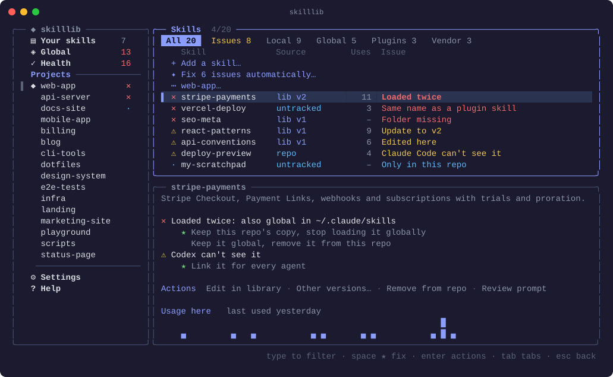
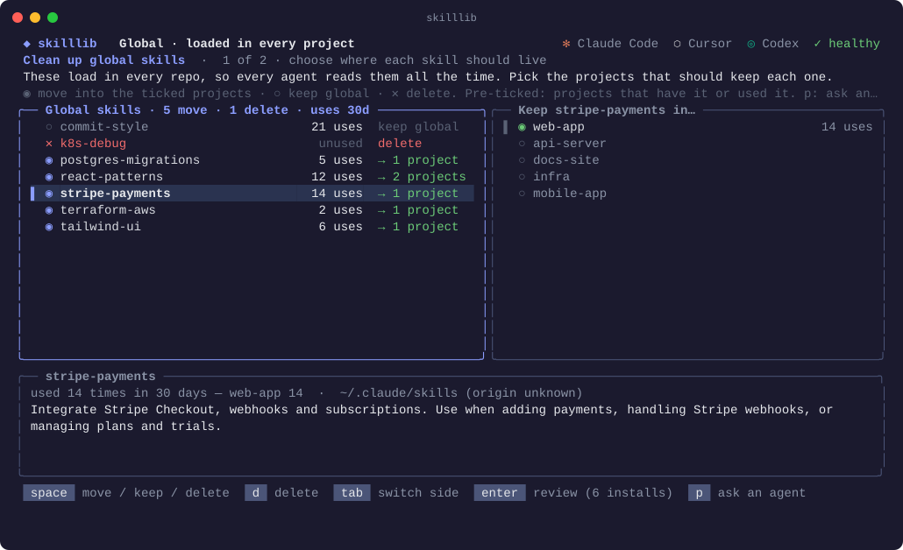

<div align="center">

# ◆ skilllib

**Manage your agent skills like dependencies.**<br>
One library for all your skills. Each repo gets only the ones it needs,<br>
and every agent you use can see them.

[](https://www.npmjs.com/package/skilllib)
[](LICENSE)


```bash
npx skilllib
```



</div>

---

## The problem

[Agent skills](https://code.claude.com/docs/en/skills) (folders with a `SKILL.md`) are one of the best ways to teach Claude Code, Cursor, Codex and Zed how *you* work. But they pile up quickly:

- **`npx skills add`** drops skills into `~/.agents/skills`.
- **Plugins** bring their own.
- **claude.ai** syncs a few more.
- **Your teammates** commit some to the repo.
- **You** copy folders into `~/.claude/skills` "just for now".

A few weeks later:

- **🌍 Global skills load everywhere.** Everything in `~/.claude/skills` or `~/.agents/skills` loads in **every repo, in every session**. Your agent reads the name and description of your Stripe skill while fixing Terraform in your infra repo. That costs context, and skills fire when they shouldn't.
- **👯 Duplicates.** The same skill arrives through `npx skills` *and* a plugin *and* a copy in the repo, and your agent sees it twice.
- **🙈 Each agent looks somewhere else.** Claude Code reads `.claude/skills`; Codex and Zed read `.agents/skills`; Cursor reads both. The skills your team committed to `.agents/skills` are invisible to Claude Code.
- **🧟 Copies drift.** You improved a skill in one repo; the other five still have the old version.
- **🤷 No overview.** Which skills does this repo actually have? Where did each one come from? Is it committed, or only on my laptop? Does anyone use it?

Most agents can't turn off a global skill for just one repo. Claude Code can, but Cursor and Codex can't. **The only real fix is to stop using global skills and give each repo what it needs.**

## How skilllib fixes it

- **📚 Your skills: one versioned library.** Every skill has a single master copy in `~/.skilllib/library`, and each change becomes a new version.
- **📦 Per-repo installs, pinned like dependencies.** Each repo lists its skills and versions in `skilllib.json`. `sync` reproduces them exactly, and `update` moves to the newest.
- **🤝 One copy, every agent.** skilllib puts one real copy in the repo and links it into whichever folders your other agents read.
- **🧹 A cleanup wizard for global skills.** For each global skill, pick the repos that should keep it, keep it global, or delete it. Usage numbers and descriptions help you decide.
- **🔎 See everything in a repo:**
  - where each skill comes from (the repo, your library, global, a plugin, claude.ai…)
  - which agents load it
  - whether it's committed to git or gitignored
  - how often it was used
- **✦ Ask an agent.** Copy a ready-made prompt with all of that data, and let Claude Code, Cursor or Codex tell you what to keep, move or delete.
- **🛟 Nothing is lost.** Every removal goes to a backup you can restore with one key.

Everything runs locally: no server, no account, no network calls.

---

## Quick start

```bash
npm install -g skilllib    # or: npx skilllib
skilllib
```

It needs **Node.js 22+** and works on macOS and Linux. Windows support is newer: it uses directory junctions, so no admin rights are needed.

On first run, skilllib asks two things:

1. **Which agents you use:** Claude Code, Cursor, Codex, Zed. The ones installed on your machine are pre-selected.
2. **Where your projects live**, e.g. `~/Projects`. It finds every git repo in there, and rescans each time it opens.

Then a good first session looks like this:

1. **Open a repo** (type its name, then Enter) to see everything its agents can use.
2. **Clean up global skills:** open **Global → ⚠ Clean up…** and decide, skill by skill, which repos keep it.
3. **Add skills** to a repo from the *Add skills* tab.

---

## Manual

### The screen

The left pane lists **places**, and the right pane shows the skills of the place you pick:

| Place | What it shows |
|---|---|
| **Your skills** | Your library: master copies, versioned. Nothing here loads anywhere until you add it to a repo. |
| **Global** | Everything your agents load in *every* repo: yours, plus vendor skills (plugins, claude.ai, Cursor built-ins). |
| **Health** | Problems with one-key fixes, and everything you can restore. |
| **Projects** | Every repo found in your project folders. `◆` marks the one you're in. |
| **Settings** | Your agents and your project folders. |
| **Help** | Where skills come from, and how each agent finds and uses them. |

### Keys

| Key | Does |
|---|---|
| *type* | Search the pane you're in. Word initials work too: `cfw` finds `cloudflare-workers`. |
| `↑` `↓` | Move |
| `space` | The main action: add, remove, copy, clean up, fix, restore |
| `enter` | Every action for the selected row (or open a place) |
| `tab` | In a repo: switch between **Usable here** and **Add skills** |
| `→` `←` | Open or close a group |
| `esc` | Clear the search, then go back to the left pane |
| `?` | Help · `ctrl+r` reload · `ctrl+c` quit |

### A repo

A repo has two lists:

**Usable here** shows everything agents can use in this repo, grouped by where it comes from:

| Group | What it is | `space` |
|---|---|---|
| *From your skills* | Versioned skills you added from your library | Remove it from this repo |
| *The repo's own* | Skills committed to the repo (e.g. your team's `.agents/skills`) | Copy it into your skills, so other repos can use it |
| *⚠ Global · yours* | Your global skills: they load in every repo | Open the cleanup wizard |
| *Global · from vendors* | Plugins, claude.ai skills, Cursor built-ins | – (manage them at the source) |

**Add skills** shows your skills that this repo doesn't have yet. `space` adds one.

Each row tells you:

| | Meaning |
|---|---|
| **✻ ⬡ ◎ ℤ** | Claude Code, Cursor, Codex, Zed. An icon in color means that agent loads the skill here; a faint one means it doesn't. |
| `²` | Cursor reaches this skill through two folders, so it may list it twice |
| `.claude` / `.agents` | The folder holding the real copy |
| **✓ committed** · **± changed** · **+ not added** · **∅ ignored** | The skill's git state. `∅ ignored` means it only exists on your machine. |
| `v2` · `v1 → v2` | The installed version, and whether a newer one exists |
| **⧉ 3 copies** | The same skill reaches your agents from 3 places. The details panel lists them; keep one. |
| last column | Claude Code uses in the last 30 days |

Related skills fold into one row: skills from the same plugin, the same source repo, or with the same name prefix (`design-*`). Press Enter on the group row for actions on all of them.

If some skills aren't visible to every agent you use, the top row offers **⇄ Make all N skills usable by …**. It adds links only; nothing is copied or moved.

### Adding and removing skills

- **Adding** (`space` in *Add skills*) copies the newest version into `.claude/skills/<name>`, which Claude Code and Cursor read. If you use Codex or Zed, it also links it into `.agents/skills`. The skill is recorded in `skilllib.json`. Agents pick it up in their next session.
- **Removing** (`space` again) deletes that copy and its links. Your library and other repos aren't touched. If you edited it here, skilllib asks first; Enter → *Save local edits to Your skills* keeps them.
- **The repo's own skills are never deleted by skilllib.** You can copy them into your library, or link them so every agent sees them.
- **Git-tracked folders:** if the repo commits the folder a link would go into (common for `.agents/skills`), skilllib asks once and remembers your answer.

### Versions

Every change to a library skill becomes a new version, kept in `~/.skilllib/store`. Repos pin the version they use:

```json
{ "skills": { "stripe-payments": { "version": 2, "hash": "318bf4b94df4911c" } } }
```

| | Like | What it does |
|---|---|---|
| `skilllib sync` | `npm ci` | Installs exactly the pinned versions and restores missing ones. It never touches your edits. |
| `skilllib outdated` | `npm outdated` | Lists skills with a newer version |
| `skilllib update [name]` | `npm update` | Moves to the newest version |
| Enter → *Install a specific version…* | `npm i x@1` | Pins any version, including older ones |

Edit a skill once in **Your skills** (Enter → *Edit SKILL.md*). Every repo that uses it then shows `v1 → v2` and can update.

### Cleaning up global skills



Open **Global → ⚠ Clean up…**, or press `space` on any of your global skills. For each skill, `space` cycles through:

- **◉ move:** installed into the repos you tick on the right. Repos that already have it, or where Claude Code used it, are pre-ticked.
- **○ keep global**
- **✕ delete** (`d`): removed without keeping a copy in your library

Each skill shows how often Claude Code used it, and the panel below shows its description and where it was used. Review, apply, and your globals are gone: moved ones are in your library and in the right repos. Originals go to a backup you can restore from **Health**.

You can also delete one skill (Enter → **Delete**) or a whole group (Enter → **Delete all N**) straight from Global.

### Ask an agent to review your skills

Not sure what to keep? **Copy review prompt** puts a ready-to-paste prompt on your clipboard (also saved to `~/.skilllib/review-prompt.md`). For each skill, it includes:

- its description and SKILL.md
- how it was installed (plugin, `npx skills`, claude.ai, copied in…)
- which agents load it
- usage per repo
- duplicates
- your project list, so the agent can check each repo's stack

Paste it into Claude Code, Cursor or Codex. You get back **keep global / move to projects / delete / turn off at the vendor** for each skill, as a table plus JSON.

It's available from:
- **Global → ✦ Ask an agent to review all global skills**
- Enter on any skill or group → **Copy review prompt**
- `p` inside the cleanup wizard

### Health and backups

**Health** lists broken links, skills loaded twice, out-of-date repos and repo-only skills, each with a one-key fix. Below them is everything skilllib ever moved out, and `space` puts it back where it came from.

skilllib never really deletes anything:
- removed library skills go to `~/.skilllib/trash`
- removed global skills go to `~/.skilllib/global-backup`

---

## Where skills come from

A skill is a folder with a `SKILL.md`. These are all the places your agents load them from:

| Where | Examples | Who sees it |
|---|---|---|
| **The repo** | `.claude/skills`, `.agents/skills`, `.cursor/skills`, `.codex/skills` | Agents working in that repo |
| **Global folders** | `~/.claude/skills`, `~/.agents/skills` (`npx skills add` installs here), `~/.cursor/skills` | **Every repo** |
| **Vendors** | Claude Code plugins (`/plugin`), claude.ai skills, Claude Code's bundled commands, Cursor built-ins and marketplace, Codex system skills | Every repo; only the vendor can remove them |
| **Your skills** | `~/.skilllib/library` | Nobody, until you add a skill to a repo |

### ✻ Claude Code · [docs](https://code.claude.com/docs/en/skills)

- **Where it looks.** When names collide, the first one listed wins:
  1. enterprise (managed settings)
  2. `~/.claude/skills`
  3. `.claude/skills`
  4. nested `<subfolder>/.claude/skills`
  5. plugins (as `/plugin:skill`)
  6. bundled

  It also reads claude.ai skills from `~/.claude/skills/synced` and folders passed with `--add-dir`. It **doesn't read `.agents/skills`** (verified).
- **How it uses them.** Descriptions are always in context; the full `SKILL.md` loads on `/name` or when Claude decides it's relevant.
  - `disable-model-invocation: true`: only you can run it.
  - `user-invocable: false`: only Claude can.
- **Per-repo control.** `skillOverrides` in `.claude/settings.json` (`"off"`, `"name-only"`, `"user-invocable-only"`). It's Claude-only, so skilllib moves skills out of global instead of blocking them.

### ⬡ Cursor · [docs](https://cursor.com/docs/context/skills)

- **Where it looks.**
  - Project: `.agents/skills` and `.cursor/skills`, including nested ones, which apply only to files inside them.
  - Your home folder: `~/.agents/skills` and `~/.cursor/skills`.
  - For compatibility: `.claude/skills`, `.codex/skills`, `~/.claude/skills` and `~/.codex/skills`.
  - Also marketplace plugins and Cursor's built-ins. Cloud Agents only see `~/.cursor/skills`.
- **How it uses them.** Descriptions decide relevance, and the full content loads on use; `/` runs one. `paths:` globs limit a skill to matching files, and `disable-model-invocation: true` makes it manual.
- **Limits.** There's no per-project switch for global skills. Its docs don't say how it handles one skill reached through two folders.

### ◎ Codex · [docs](https://learn.chatgpt.com/docs/build-skills)

- **Where it looks.** `.agents/skills` in the working folder, its parents and the repo root; then `~/.agents/skills`; `/etc/codex/skills` (admin); and OpenAI's bundled skills. It **doesn't read `.claude/skills`**.
- **How it uses them.** Names and descriptions come first (about 2% of context); `SKILL.md` loads when used, and `$` picks one.
  - Same-name skills aren't merged.
  - `policy.allow_implicit_invocation: false` in `agents/openai.yaml` keeps a skill manual.
  - `[[skills.config]] … enabled = false` in `~/.codex/config.toml` disables one everywhere.

### ℤ Zed · [docs](https://zed.dev/docs/ai/skills)

- **Where it looks.** `<worktree>/.agents/skills` (trusted worktrees only) and `~/.agents/skills`. Only direct child folders count, and on a name collision the project's skill wins.
- **How it uses them.** The agent sees a catalog of names and descriptions; `/` or `@skill` runs one. Changes apply without a restart.

---

## Command line

Everything the app does also works as a command, for scripts and CI:

```
skilllib                        open the app (prints `status` when piped)
skilllib scan [folder...]       add project folders and scan them
skilllib folders [add|remove]   show or change project folders
skilllib harnesses [id...]      show or set your agents (claude-code cursor codex zed)

skilllib status                 this repo's skills
skilllib add | remove <name>    change this repo's skills
skilllib sync [--all]           install exactly the pinned versions
skilllib outdated [--all]       skills with a newer version
skilllib update [name...]       move to the newest versions
skilllib link [--all]           make every skill here usable by all your agents

skilllib list | show <name>     your library
skilllib import <dir>...        add skill folders to your library (--global: all your global skills)
skilllib new <name> [desc]      create a skill

skilllib usage [--days N]       which skills Claude Code used
skilllib doctor [--fix]         find (and fix) problems
skilllib restore [name]         put back something skilllib moved out
skilllib --version
```

Flags: `--force` (overwrite local edits), `--allow-tracked` (link into git-tracked folders), `--days N`.

## Files

| Path | What |
|---|---|
| `<repo>/skilllib.json` | The repo's skills and pinned versions. **Commit it.** |
| `~/.skilllib/library/` | Your skills (master copies). Worth putting under git. |
| `~/.skilllib/store/` | Every version of every skill, immutable |
| `~/.skilllib/config.json` | Your agents, project folders, hidden projects |
| `~/.skilllib/trash/`, `global-backup/` | Everything skilllib removed, restorable from Health |
| `~/.skilllib/review-prompt.md` | The last review prompt you copied |

Environment variables: `SKILLLIB_HOME` moves `~/.skilllib`, `$VISUAL` / `$EDITOR` set the editor, and `CLAUDE_CONFIG_DIR` is honored.

## FAQ

**Does it change my repos?** Only when you tell it to: adding, removing or linking a skill, which updates `skilllib.json`. It asks before writing into a folder git tracks, and it never deletes a repo's own skills.

**Can I share skills with my team?** Commit `skilllib.json` along with the copies in `.claude/skills`. Or keep your library in a git repo and point `SKILLLIB_HOME` at it.

**Why does usage only count Claude Code?** It's the only agent here with local transcripts to read. Cursor doesn't keep them locally, and Codex's format hasn't been tested yet. That's why "unused" is a strong hint, not proof.

**What's not supported yet?**
- Cursor marketplace plugin skills: Cursor doesn't record which ones are enabled in a file skilllib can read.
- Unloading a `npx skills` skill doesn't update that tool's lock file.
- Installing new skills straight from GitHub is coming. For now, `skilllib import <folder>` or copy one from a repo.

---

## Development

```bash
pnpm install
pnpm test && pnpm type-check && pnpm build   # tests run on bun
pnpm dev                                     # run from source
npm link                                     # use your checkout as `skilllib`
```

**Releasing:**
1. Bump `version` in `package.json` and merge to `main`.
2. Tag and push:
   ```bash
   git tag v1.0.1 && git push --tags
   ```

CI then tests on Linux, macOS and Windows, publishes to npm through [trusted publishing](https://docs.npmjs.com/trusted-publishers) (no token; provenance is automatic), and creates a GitHub release.

The earlier registry-server version (Next.js, Postgres, S3) lives on the `archive/registry-server` branch.

## License

[MIT](LICENSE) © Toni Tralice
