# skilllib TUI: design

How the app looks and behaves, and why. It's written for people and for agents changing the TUI.

- **The code is the source of truth.** This doc explains it; if they disagree, the code wins and this doc gets fixed.
- **Every screen here is rendered from the app**, on the sample data in `src/tui/sample.ts`, by `pnpm design` (`src/tui/design.ts`). Each is in `docs/design/` twice: `<name>.svg` to look at, `<name>.txt` to read (the same characters without color; selection and highlights only show in the SVG).
- Change the UI → run `pnpm design` → update this doc in the same PR. See [Changing the design](#changing-the-design).

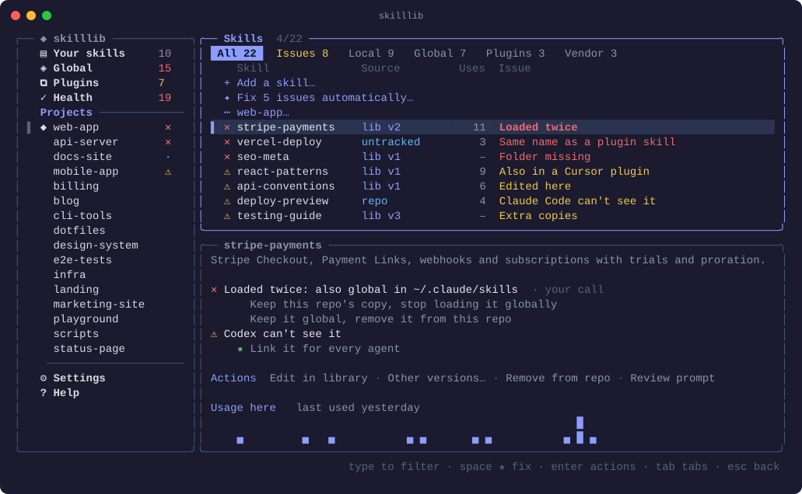

---

## Principles

These came out of many rounds of using it. Each one has been broken before and felt wrong; keep them.

1. **One path through the app: Places → list → details.** `enter` or `→` goes one pane deeper, `esc` or `←` one pane back, always. No key jumps sideways to a different place.
2. **Typing filters the pane you're in.** Letters, digits, `-`, `_` and `.` are never commands (skill names use them). Commands live on `space`, `enter`, arrows, `tab`, `?` and `ctrl`.
3. **Show each fact once.** If the list says it, the details don't repeat it; if the sidebar shows a count, the list title doesn't. When something appears twice, remove one.
4. **Details are about where you're looking from.** Seen from a repo, a skill shows that repo's issues, uses and actions. Machine-wide matters (global copies, plugins) are Global's business; a repo only says "Loads in every repo" and offers *Open in Global*.
5. **Every row has something to do.** A details pane is never empty of actions. Rows that start something (`+ Add a skill…`) are rows too, pinned on top.
6. **Fix it where you see it.** An issue carries its fixes. `★` marks the recommended one and `space` applies it. Issues that are a matter of taste are marked *your call*: `space` shows the choices instead, and "fix all" never touches them.
7. **Say what happens before it happens.** Every change shows a preview (what moves where, which repos) in the confirm box or the repo picker.
8. **Nothing is lost.** Anything skilllib removes goes to Settings › Backups, and `enter` there puts it back.
9. **Quiet by default.** One line at the bottom: a few hints for where you are, replaced by the result of what you just did until the next key.

---

## Layout

Two layouts, picked by terminal width (`SIDEBAR_AT = 80` columns in `App.tsx`).

### 80 columns or more: three panes

```
╭ Places ──╮╭ List ─────────────────────╮
│          ││ tabs · column titles      │
│          ││ rows                      │
│          │╰───────────────────────────╯
│          │╭ Details ──────────────────╮
│          ││ the selected row          │
╰──────────╯╰───────────────────────────╯
 hints, or the last message
```

- **Places** is 28 columns wide (`SIDEBAR_W`): your skills, Global, Plugins, Health, every repo, then Settings and Help.
- **List and details share the rest.** With 30 rows or more (`split`), details sit under the list and half the height goes to each. Shorter terminals show the list only, and `enter` swaps in the details.
- **Focus** is the pane with the bright border (`accent`); the others are dim (`accentDim`). Only the focused pane shows a selection background.
- While Places is focused on a repo, the details pane shows the repo's overview (folder, remote, branch, `skilllib.json` state, the plugins that load there).

| | |
|---|---|
| 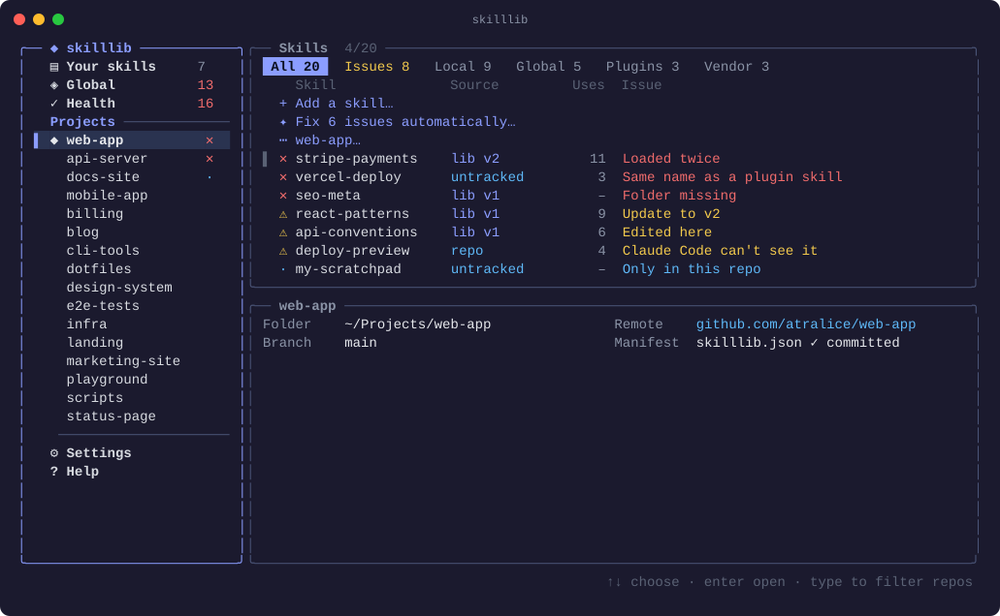 | 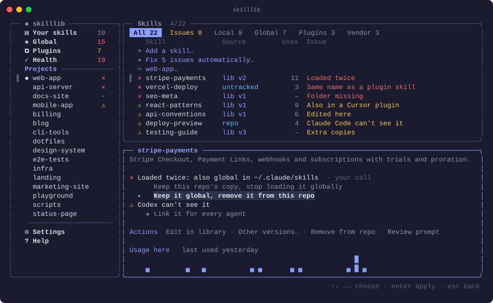 |
| Start: Places focused on the repo you're in | Details focused: `↑↓` between fixes, `←→` along actions |

### Under 80 columns: a top bar

Places become a one-line bar at the top; `←` `→` switch places. A repo's overview sits in a small panel above its list, since there's no Places pane to show it.

| | |
|---|---|
| 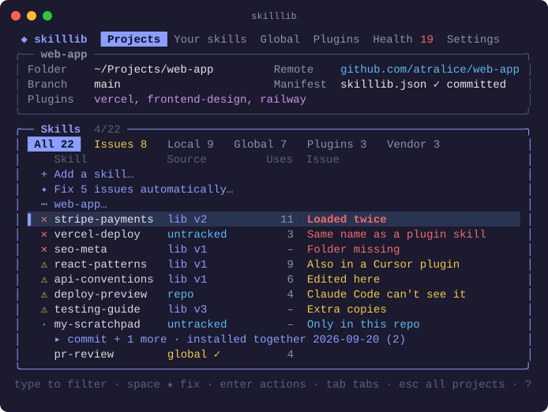 | 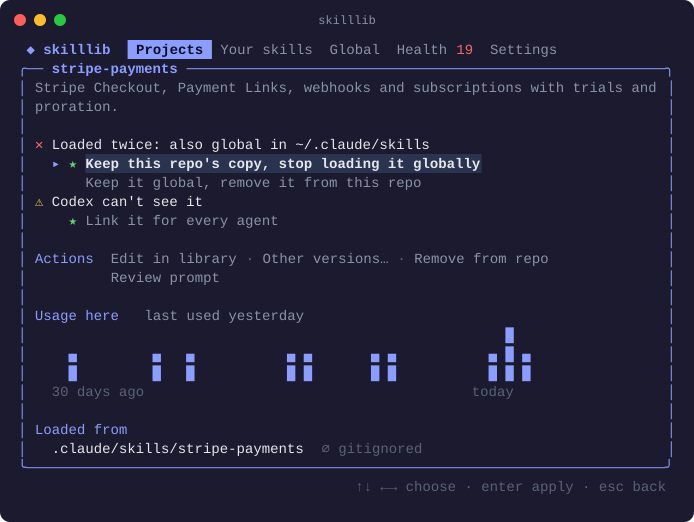 |
| A repo, 78×24 | Short terminal: `enter` swaps the list for the details |

---

## Keys

| Key | Does |
|---|---|
| *type* | Filter the pane you're in. Word initials match too: `cfw` finds `cloudflare-workers` (`W.matches`). In Places it filters repos. |
| `↑` `↓` | Move. In details, from line to line (a fix per line, or a row of actions). |
| `enter` `→` | One pane deeper. On a list row: focus its details. In details: apply the selected option. On a closed group: open it. |
| `esc` `←` | One pane back. `esc` clears a filter first. `←` in details moves left along a row of actions, and goes back from its first one. On an open group or one of its skills, `←` closes the group. |
| `space` | Apply the `★` fix of the row's worst issue; for *your call*, jump to its choices in the details. On a group: open or close it. |
| `tab` `⇧tab` | Next / previous tab |
| `?` | Keys and symbols |
| `ctrl+r` | Read everything again from disk |
| `ctrl+c` | Quit |

The hints at the bottom change with focus and modal (`hints` in `App.tsx`); keep them to what works right now.

---

## Places

### A repo (Projects)

The dashboard for one repo: everything agents can use in it, one row per skill.


- **Action rows:** `+ Add a skill…`, `✦ Fix N issues automatically…` (only when there are some), `⋯ <repo>…` (open its folder, hide it, a review prompt for its skills).
- **Columns:** severity · Skill · Source · Uses (Claude Code, 30 days, this repo) · the worst issue in a few words.
- **Source tags:** `lib v2` (from your library, `accent`) · `repo` (committed by the team) and `untracked` (only on this machine), both `blue` · `global` / `global ✓` (kept on purpose), `yellow` · `⧉ vercel` (a plugin, `magenta`) · `◆ skilllib` (skilllib's own skill, `accent`) · `claude.ai`, `cursor` (`muted`).
- **One row per skill**, even when it loads from several places. The row shows the repo's copy first, then yours, then vendors' (`COPY_RANK`); the details list every copy under *Loaded from*.
- **Tabs:** All · Issues · Local · Global · Plugins · Vendor, each with its count. The Issues count is yellow when it isn't zero.
- **Order:** worst issue first, then most used, then name. The order is fixed when a view opens and doesn't change after a fix, so rows stay under the cursor. It's re-sorted once when usage arrives (usage loads after the first paint because reading transcripts is slow).

| | |
|---|---|
| 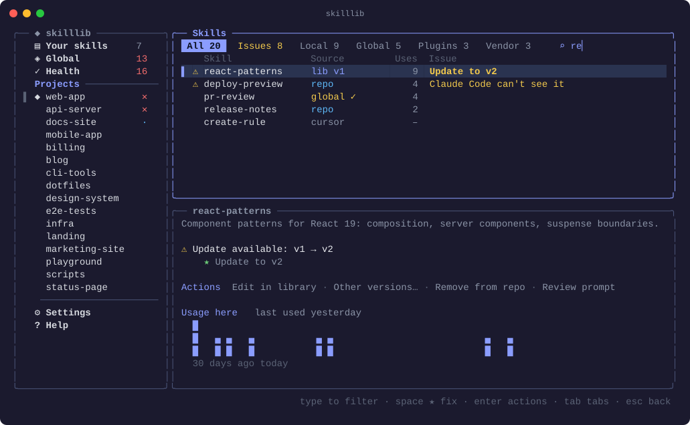 | 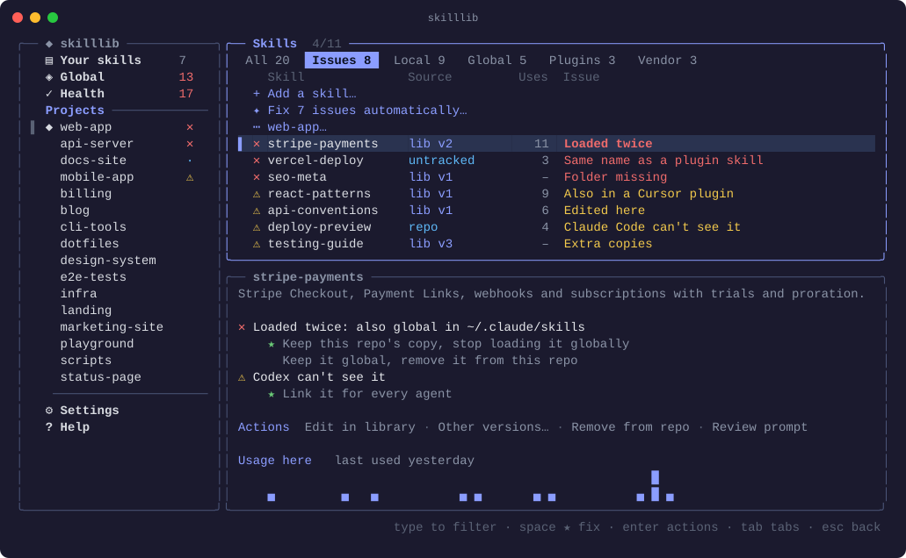 |
| Typing `re` filters; action rows hide while filtering | `tab` → Issues |
| 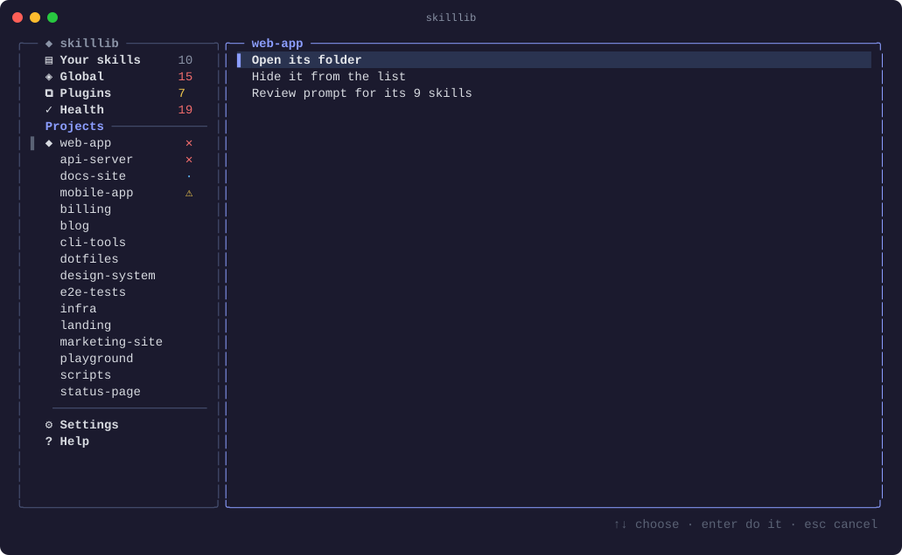 | |
| `⋯ web-app…` | |

A skill's details, top to bottom:

1. Description (up to 3 lines)
2. Issues, worst first, each followed by its fixes (`★` on the recommended one; *· your call* after the title of a decision). Or `✓ No issues`.
3. `Actions` — everything else, side by side and wrapping. Anything an issue above already offers isn't repeated.
4. `Usage here` — last used, a 30-day bar chart. In Global and Your skills it's `Usage`, with a bar per repo.
5. `Loaded from` — each copy's path and git state (`✓ committed`, `± uncommitted changes`, `+ not committed`, `∅ gitignored`).

### Your skills

Your library: versioned master copies that repos install from.

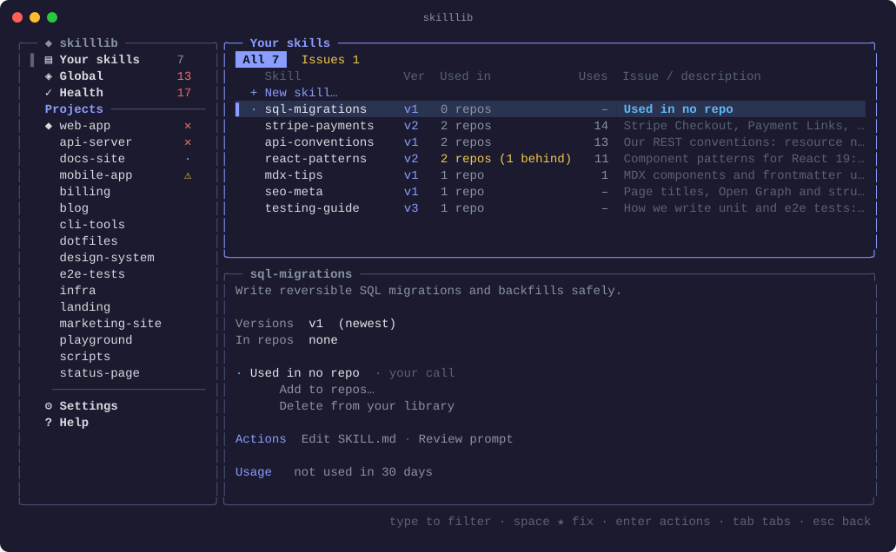

- **Action row:** `+ New skill…`.
- **Columns:** Skill · Ver · Used in (repos, and how many are behind, in yellow) · Uses (everywhere) · the issue or the description.
- **Only issue:** *Used in no repo* (hint, your call): add it to repos, or delete it.
- **Actions:** Add to repos… · Remove from repos… · Delete from your library (from every repo too; the confirm names them) · Edit SKILL.md · Review prompt.

### Global

Everything that loads in every repo: your global folders, plugins, claude.ai skills, Cursor built-ins. Titled *Loads everywhere*.

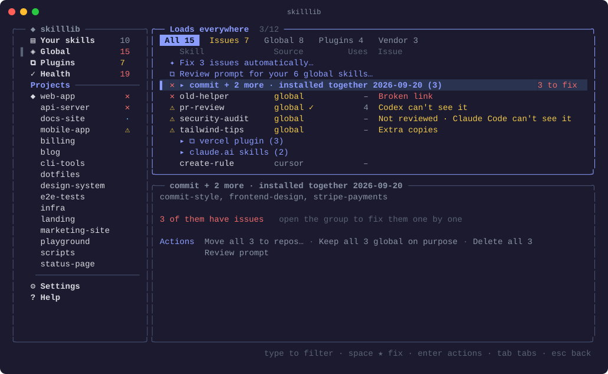

- **Action rows:** `✦ Fix N issues automatically…`, `⧉ Review prompt for your N global skills…`.
- **Tabs:** as a repo's, without Local.
- **Issues:** broken links, loaded twice (a global copy and a plugin, or two global copies), and *Not reviewed* for each of your global skills you haven't decided about.
- **Vendor skills** can't be changed from here. Their actions say where to turn them off; a plugin's skills and groups offer *Open vercel in Plugins*, where plugins are managed.
- **The skilllib skill** (`◆ skilllib`, in the Global tab): out of date, its row offers the update; its action removes it (`skilllib agent-skill remove`).

| | |
|---|---|
| 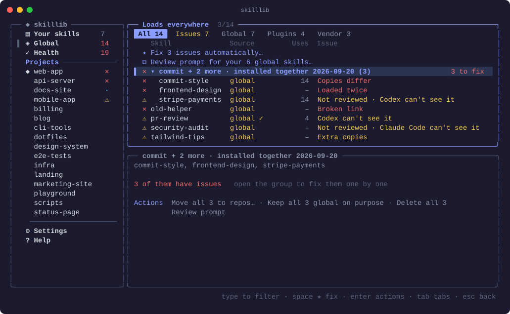 | 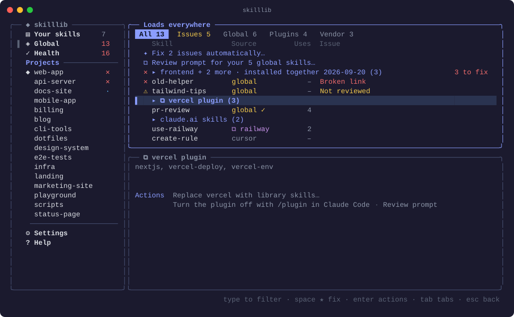 |
| A group, opened with `→` | A plugin's group: *Open vercel in Plugins* |

### Plugins

Every plugin installed, on or off, one row per install (a plugin can be installed for you and again in a project). Global shows a plugin's skills; this is where the plugin itself is turned on or off, updated, uninstalled or replaced.

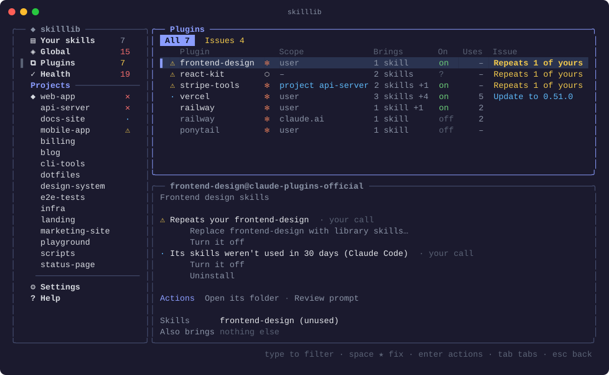

- **Columns:** severity · Plugin (its name; the details title is `name@marketplace`) · agent (`✻` Claude Code, `⬡` Cursor) · Scope (`user`, `project <repo>`, `local <repo>` in `blue`, `claude.ai`) · Brings (`N skills +k`, k = other kinds: commands, agents, hooks, MCP servers) · On (`on` `green`, `off` `faint`, `?` for Cursor) · Uses (Claude Code, 30 days, by skill name) · the worst issue.
- **Tabs:** All · Issues.
- **Issues** are all *your call* (turning plugins on or off and updating them changes code that runs in your sessions, so "fix all" never does): *Repeats N of yours*, *Unused 30 days*, *Update to vN*.
- **Actions:** Turn it on / off · Update to vN · Replace *plugin* with library skills… · Uninstall · Open its folder · Review prompt. A synced plugin can't be uninstalled; a Cursor plugin only says to turn it off in Cursor.
- **Details:** description, issues, actions, then *Skills* (with their uses), *Also brings*, *Installed* (scope, repo, version, marketplace) and *Folder*.
- **The sidebar count** is the number of plugins, yellow when one repeats your skills (hints don't color it).

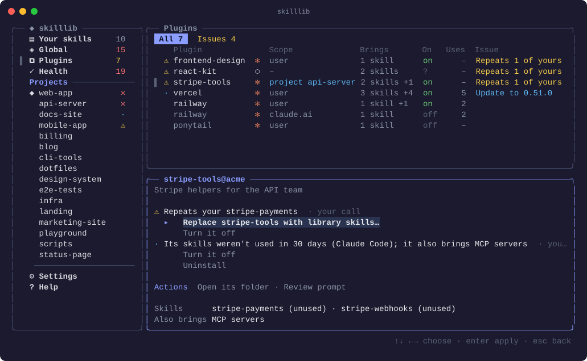

### Health

Every skill with something to fix, in every repo and in Global, worst first. The same rows and details as where they live, with a *Where* column instead of Source and Uses. When your agents don't have the skilllib skill, a `skilllib` row (Where: *Your agents*) offers to install it. The sidebar count is the number of skills flagged, colored by the worst.

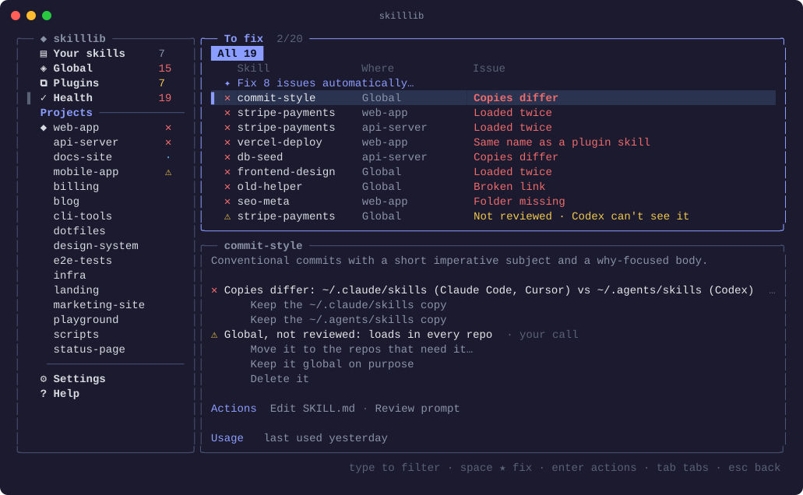

### Settings

Agents (`[x]` toggles which ones skilllib makes skills visible to) and the skilllib skill for them (`enter` installs it), project folders, hidden repos, and backups (`↺ name`, `enter` restores).

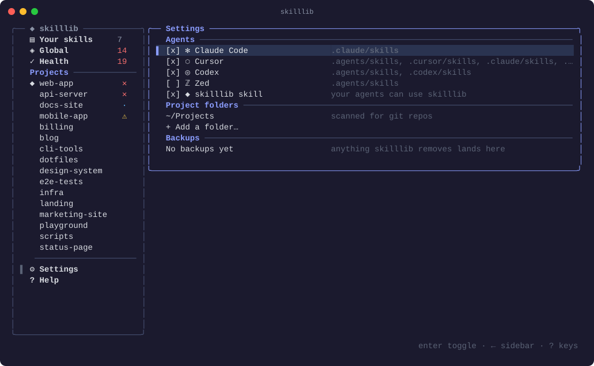

### Help

`?` anywhere. Any key closes it.

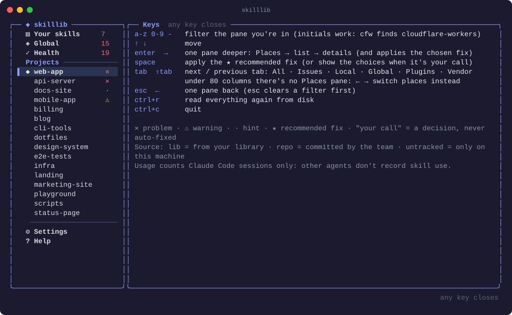

---

## Groups

Related skills fold into one row (`▸`), in a repo, Global and Your skills. Filtering shows every skill unfolded.

A skill's candidate groups, strongest first (`W.groupCandidates`):

1. **Where it came from**: a plugin (`⧉ vercel plugin`), claude.ai, Cursor built-ins, or its origin (an `npx skills` repo, a group you moved together, a plugin you replaced).
2. **When it arrived**: global folders created in the same minute (`frontend + 2 more · installed together 2026-09-20`). Not used for your library, where imports make every folder's time the same.
3. **Its first word**, 3 letters or more (`cloudflare-*`).

`W.assignGroups` gives each skill its strongest candidate that another skill shares, and drops groups of one.

A group row shows its worst severity, its label and size, and how many members have issues. Its details list the members and actions for all of them at once: *Move all N to repos…*, *Keep all N global on purpose*, *Delete all N*, *Add all N to repos…*, *Remove all N from this repo*, *Open plugin in Plugins*, *Review prompt*.

---

## Issues

Defined in `src/tui/world.ts`: `issuesOf` for a repo's skills, `machineIssues` for Global, `pluginIssues` for Plugins. Each has an `id`, a `severity`, a `title` (the details), a `short` (the list), `decision` (your call) and `fixes`; the first fix of a non-decision is the `★` one.

| Where | Short | Severity | Your call | Fixes |
|---|---|---|---|---|
| Repo | Folder missing | ✕ | | Restore it (sync) |
| Repo | Pinned, not in your library (folder missing, and your library has no copy: import it, or set SKILLLIB_HOME) | ✕ | yes | Remove it from skilllib.json |
| Repo | Not in your library | ✕ | | Copy it back into your library |
| Repo | Loaded twice (also global) | ✕ | yes | Keep this repo's copy, stop loading it globally (names the other repos that used it) · Keep it global, remove it from this repo |
| Repo | Extra: you keep it global | ⚠ | yes | Remove this repo's copy, keep it global · Stop loading it globally after all |
| Repo | Same name as a plugin/claude.ai/cursor skill | ✕ | yes | Remove this repo's copy · Turn the plugin off |
| Repo | Cursor also lists a plugin's copy (the repo turned the plugin off for Claude Code; Cursor ignores repo settings) | ⚠ | yes | Replace *plugin* with library skills… |
| Repo | Extra copies (identical copies, or links no agent needs) | ⚠ | | Keep one copy, plus the links your agents need |
| Repo | Copies differ (which agent runs which) | ✕ | yes | Keep the … copy (one per copy that can win) |
| Repo | Also in a Cursor plugin | ⚠ | yes | Turn the plugin off in Cursor (reported only) |
| Repo | Edited here | ⚠ | yes | Save as vN+1 in your library · Discard the edits |
| Repo | Update to vN | ⚠ | | Update to vN |
| Repo | *Agent* can't see it | ⚠ | | Link it for every agent |
| Repo | *Agent* can't see it: commit it first (only links into folders git tracks would help, and the copy isn't committed) | ⚠ | yes | none (reported only) |
| Repo | Differs from library | · | yes | Update your library from this copy · Replace it with the library version |
| Repo | Not tracked | · | yes | Track it |
| Repo | Only in this repo | · | yes | Import it into your library |
| Repo | Unused 30 days | · | yes | Remove it from this repo |
| Global | Broken link | ✕ | | Remove the link |
| Global | Loaded twice (also from a plugin, claude.ai or Cursor) | ✕ | yes | Keep that copy, stop loading yours globally |
| Global | Extra copies (identical copies in several global folders) | ⚠ | | Keep one copy, plus the links your agents need |
| Global | Copies differ (which agent runs which) | ✕ | yes | Keep the … copy (one per copy) |
| Global | Also in a Cursor plugin | ⚠ | yes | Turn the plugin off in Cursor (reported only) |
| Global | Not reviewed | ⚠ | yes | Move it to the repos that need it… · Keep it global on purpose · Delete it |
| Your skills | Used in no repo | · | yes | Add to repos… · Delete from your library |
| Plugins | Repeats N of yours (a skill in your library or global folders) | ⚠ | yes | Replace *plugin* with library skills… · Turn it off (Cursor: turn it off in Cursor) |
| Plugins | Unused 30 days (on, ships skills, none used) | · | yes | Turn it off · Uninstall |
| Plugins | Update to vN (the marketplace declares a newer version or commit) | · | yes | Update to vN |

Extra copies and copies that differ come from `tidy.ts` (read in `load.ts`); their fix asks before changing a file git tracks, and **Fix all** skips those changes. While a skill's copies differ, the library hints (*Differs from library*, *Not tracked*, *Only in this repo*) are hidden: the copy they'd compare is arbitrary.

Severity: `✕` problem (`red`), `⚠` warning (`yellow`), `·` hint (`blue`). A row shows only its worst; a repo in Places shows the worst of its skills.

---

## Modals

All replace the content area (Places stays visible), except confirm, which opens under the list. `esc` cancels (Help closes on any key; the first-run agents question can't be skipped).

| | |
|---|---|
| 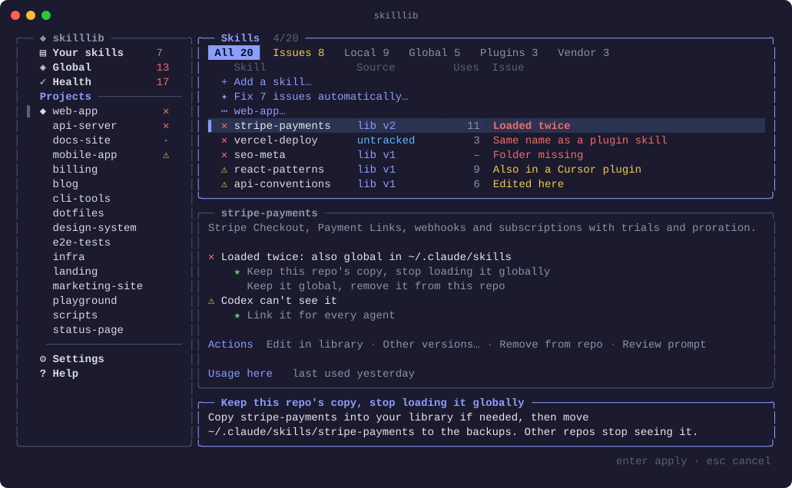 | 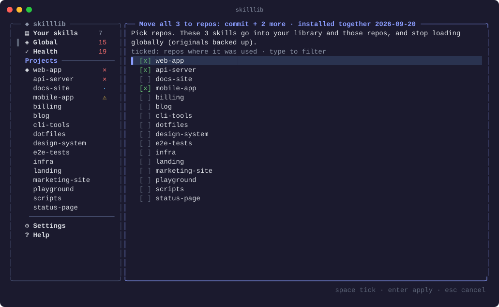 |
| **Confirm**: the fix as its title, the preview as its body, as tall as the preview needs. `enter` or `y` applies. | **Repo picker**: the preview, then repos to tick with `space`. Pre-ticked: repos where the skill was used. Typing filters. Refuses an empty pick unless the fix allows it. |
| 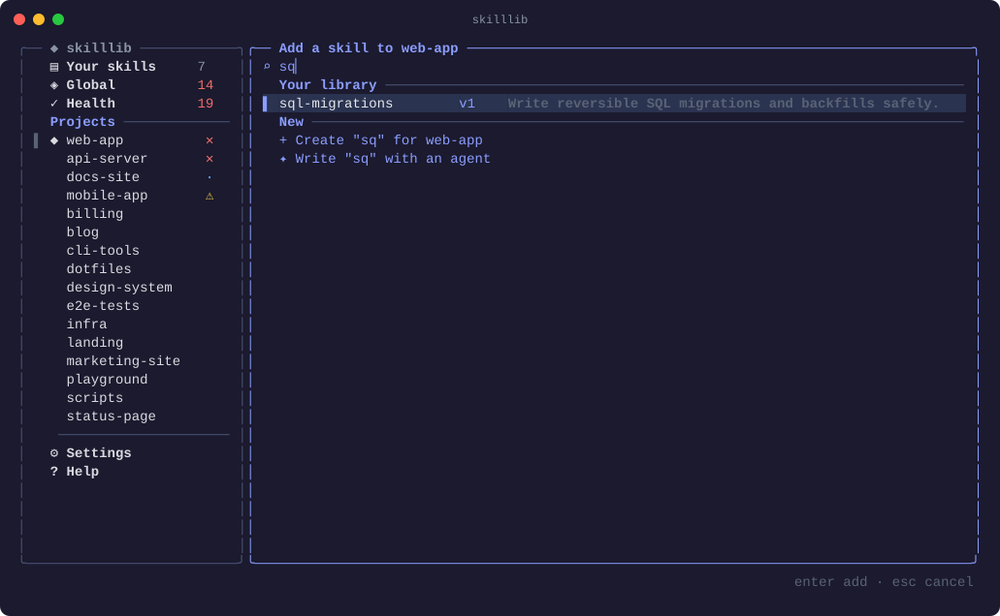 | 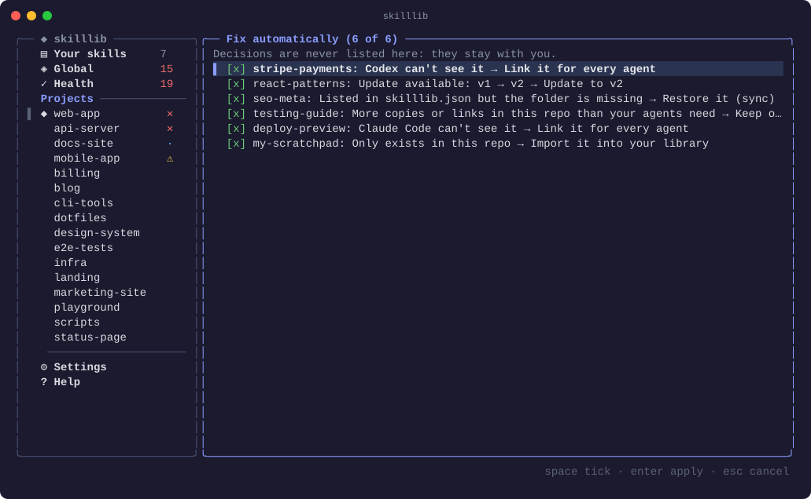 |
| **Add a skill**: one box. Typing searches your library; the last rows create a skill with that name (it opens in `$EDITOR`) or copy a prompt for an agent to write it. | **Fix automatically**: every non-decision issue with its `★` fix, all ticked; untick with `space`. |

Also: **menu** (a list of options, e.g. `⋯ repo…`), **input** (one line, e.g. a project folder), and **agents** (the first run: which agents you use, then where your projects are).

After a change, the app reads everything from disk again (`reload`) and shows the result on the bottom line: `✓` (`green`) when it worked, `✗` (`red`) when it failed (`failed` results, and errors), `!` (`yellow`) when it waits on a follow-up question (`then`). A result can carry such a question, such as allowing links in a git-tracked folder, which opens as another confirm. `esc` on it keeps the result on the bottom line, so you still see what the change left undone (e.g. which agents can't see a skill). **Fix all** doesn't ask follow-ups: its result counts what it applied, and names each fix it held back and why (e.g. git tracks the folder), and each one that failed.

Changing what every repo loads (stopping a global skill, or swapping yours for a plugin's copy) is always a decision, never in **Fix all**.

---

## Visual language

### Colors (`src/tui/theme.ts`)

| Token | Hex | Used for |
|---|---|---|
| `accent` | `#8B9DFF` | Focused border and title, section headers, action rows, group rows, `lib vN`, the selected tab's background |
| `accentDim` | `#4B5578` | Unfocused borders, separators, secondary bars in usage charts |
| `text` | `#E5E7EB` | The selected row, values, titles in details |
| `muted` | `#8A93A6` | Descriptions, labels, counts, unselected tabs |
| `faint` | `#5A6275` | Column titles, hints, *your call*, empty values |
| `green` | `#6BCB77` | `✓`, `★`, `[x]`, success messages, Health with nothing to fix |
| `yellow` | `#F2C94C` | Warnings, `global`, repos behind, the Issues tab count |
| `red` | `#EF6B6B` | Problems, `✗` failed actions |
| `magenta` | `#C792EA` | Plugins (`⧉ name`) |
| `blue` | `#5EB8F7` | Hints, `repo` and `untracked`, remotes |
| `selection` | `#2A3350` | The selected row's and option's background (focused pane only) |

Text on an `accent` background (the selected tab, the top bar's place) is `#0B1020`.

### Symbols

| | Means |
|---|---|
| `▌` | The cursor row |
| `▸` / `▾` | A closed / open group; in details, the selected fix |
| `✕` `⚠` `·` | Problem, warning, hint |
| `★` | Recommended fix |
| `✓` | No issues; `global ✓` = kept global on purpose; `✓ committed` |
| `◆` | The repo you're in (and the app's mark) |
| `▤` `◈` `⧉` `✓` `⚙` `?` | Your skills, Global, Plugins, Health, Settings, Help |
| `⧉` | A plugin; also *copy a prompt* |
| `✦` | Automatic: fix all, or an agent writes it |
| `+` `⋯` `↺` | Add or create · more for this repo · restore a backup |
| `±` `+` `∅` | Git: uncommitted changes · not committed · gitignored |
| `⌕ text▏` | The current filter |
| `✻` `⬡` `◎` `ℤ` | Claude Code, Cursor, Codex, Zed |
| `…` | Truncated, or opens something more (`Add to repos…`) |

### Text

- Labels are plain actions: *Remove from repo*, *Keep it global on purpose*. A label ending in `…` asks something before acting.
- Previews say exactly what moves where: `Move ~/.claude/skills/x to Settings › Backups`.
- No jargon on screen: "Loaded twice", not "duplicate resolution".

---

## Code map

| File | Role |
|---|---|
| `src/tui/App.tsx` | Every screen, the keys and the layout |
| `src/tui/components.tsx` | `Panel`, `ListPanel`, `wrap` |
| `src/tui/theme.ts` | Colors |
| `src/tui/world.ts` | The model the screens render (`World`), issues, fixes, groups, search. No I/O. |
| `src/tui/load.ts` | Fills a `World` from disk (plugins from `plugins.ts`' `installedPlugins` and `cursorPlugins`); its `ops` make the changes (through `library.ts`, `config.ts`, `plugins.ts`) |
| `src/tui/sample.ts` | A `World` in memory, for tests, `snapshot.tsx` and these screens |
| `src/tui/prompts.ts` | Review and write-a-skill prompts |
| `src/tui/snapshot.tsx` | Renders the app headless: `SIZE=118x30 STEPS='["enter","#a"]' npx tsx src/tui/snapshot.tsx` (`REAL=1` reads your machine instead) |
| `src/tui/design.ts` | The screens in this doc (`SCREENS`), and the ANSI → SVG conversion |

The contract between screens and data is `World` and its `Ops`. An op returns a message, or a message plus a follow-up fix (`{ message, then }`). The screens never touch the disk.

---

## Changing the design

1. Change `App.tsx` / `world.ts`. If the new state doesn't appear in the sample data, add it to `sample.ts`.
2. Add or update the screen in `SCREENS` (`src/tui/design.ts`). Steps are keys as `snapshot.tsx` takes them: `down up left right enter esc tab stab space bs`, or literal characters, space-separated (`"r e"` types `re`).
3. `pnpm design`, and look at the `.txt` files it changed.
4. Update this doc: the principle, place, issue or symbol it touches.
5. `pnpm test && pnpm type-check`.
